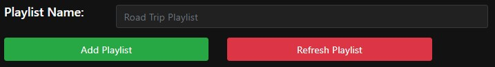
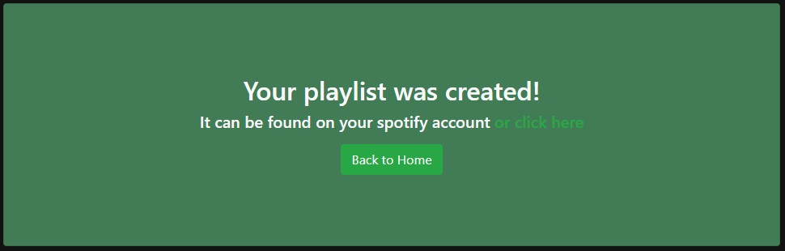

<h1 align="center">🎶 Road Mixify 🎶</h1>

Road Mixify is an <a href="https://angular.io">Angular</a> web app allowing <a href="https://www.spotify.com/">Spotify</a> users to create randomized playlists based on
road-trip duration and user-selected artists and albums. Users are allowed to select as many artists/albums they want on their playlist,
and the app will create a personalized playlist that matches their exact road-trip duration.

---
## Development

### Angular
Angular was the main web framework used to handle all the components and views. The main randomizing playlist algorithm was developed within Angular and involved making
HTTP requests to the Spotify API. Any URI route that you visit on the app will have a corresponding component that generates the view for it. These components can be found within
the <a href="https://github.com/kushbhag/RoadMixify/tree/main/client/src/app/components">client/src/app/components</a> folder. The main routes that the application uses
can be found within the <a href="https://github.com/kushbhag/RoadMixify/blob/main/client/src/app/app-routing.module.ts">app-routing</a> file. Services are injected throughout
the application to provide the main functionality for the program. The 
<a href="https://github.com/kushbhag/RoadMixify/blob/main/client/src/app/services/playlist.service.ts">playlist service</a> is used to store all the user data, as well as the
playlist information, while the <a href="https://github.com/kushbhag/RoadMixify/blob/main/client/src/app/services/spotify.service.ts">spotify service</a> is used to send
GET and POST requests to the Spotify API.

### Node.js
For the web app to make any calls to the Spotify API, I would first need to get a user's access token.
To do this, I created a server using Node.js that lets Spotify authorize the user, and then call back to my application
with the access and refresh tokens. The access token is used to make HTTP requests on behalf of the user to get requested data such as artist and album information. Each access
token normally lasts for only an hour, which is why the refresh token is used to return a new access token **without** having to have the user log in again.
Each access token is unique depending on the authorization scopes that I request from the user. For my application, I only request the following:
1. <a href="https://developer.spotify.com/documentation/general/guides/scopes/">user-read-private</a>
2. <a href="https://developer.spotify.com/documentation/general/guides/scopes/">playlist-modify-public</a>
3. <a href="https://developer.spotify.com/documentation/general/guides/scopes/">playlist-modify-private</a>

The server was deployed using <a href="https://www.heroku.com/">Heroku</a>, and it's only purposes is logging in, and refreshing the access token. Full documentation for authorization
can be found on the <a href="https://developer.spotify.com/documentation/general/guides/authorization-guide/">Spotify website</a>.

---
## Application

### Login
When a user opens the application for the first time, they are greeted with a welcome message along with a button that lets them log in to their Spotify account.

The user is then redirected back to the home page, where they will see a button that routes them to the playlist page.

### Playlist Form
The playlist form was meant to look very clean and easy to use. Users can input any duration between 0 seconds and 24 hours (exclusive), which determines the length of
the playlist. At least one artist or album must be entered within the form to submit. Advanced settings are currently still being worked on, but can allow users to 
not allow any explicit songs, make their playlist private, or remove certain albums from the user entered artists.

### Playlist Viewer
Within seconds after the form is submitted, the app will generate a randomized playlist of unique songs. The songs will then be displayed in an organized
table. If the playlist does not match or exceed the duration time, then the form will provide a small message at the bottom indicating so, and may require you to
return and add more artists/albums (if you want the duration to match your road-trip). The name of the playlist will default to 'Road Trip Playlist' but can be changed in the small text box found at the bottom of the page.

### Refresh Playlist
The app allows you to refresh the playlist as well, in the off chance that you don't like certain songs.

The table will then allow you to select any songs that you'd wish to keep on the playlist even after the refresh. Once the user is done selecting songs, they
can click 'Confirm Refresh' and new songs will be generated. **Although, due to the randomness of the algorithm, there is a high chance that many of the same not-selected songs will be added back to the playlist even after the refresh.**

### After Adding Playlist
After clicking the 'Add Playlist' button, the songs will be added to a public/private playlist on your Spotify account with the desired playlist name. A link for the playlist
will also be shown on the final page and will send you directly to your generated playlist so that you can get start listening right away!

